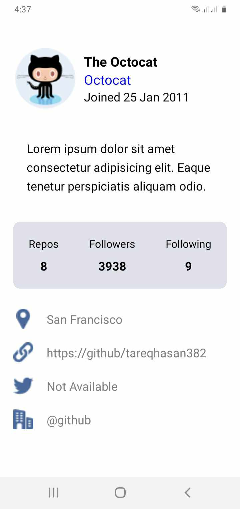

# Assignment-1

React Native Expo app designed to showcase a delightful user experience.

## Overview

This app offers a seamless interface, blending functionality with aesthetics. It provides essential profile information, statistics, and insights into various aspects of the user's profile.

## Features

- **Hero Section**: A visually appealing section displaying profile information.
- **Informative Sections**: Insights into repository count, followers, following, and location.
- **Modern Design**: Elegant interface with intuitive navigation.
- **Responsive**: Compatible with multiple devices and screen sizes.

## Screenshots

## Usage

To run this app locally:

1. Clone this repository.
2. Navigate to the project directory.
3. Run `npm install` to install dependencies.
4. Run `npm start` to start the Expo development server.
5. Use Expo Go app on your device or emulator to view the app.

## Technologies Used

- React Native
- Expo
- Expo Status Bar
- React Native Safe Area Context
